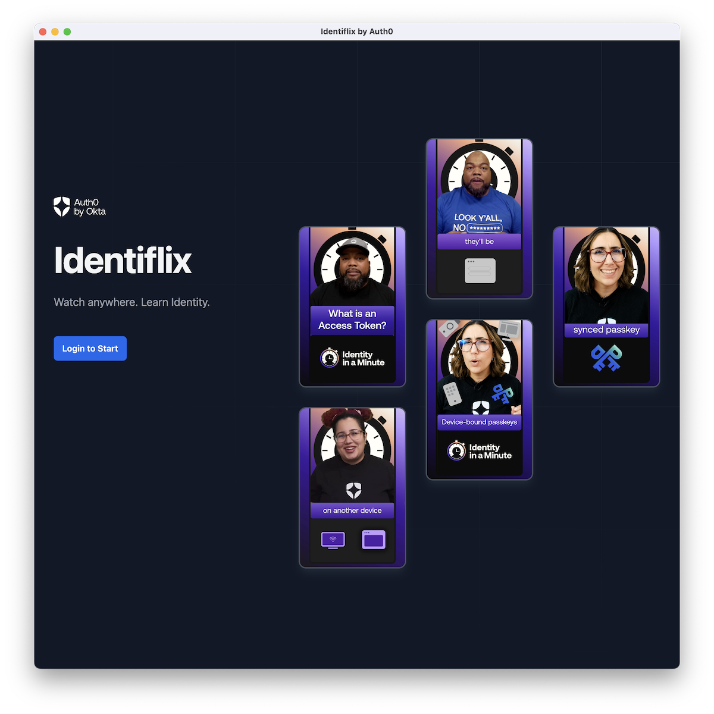

# Auth0 by Okta - Identiflix

Identiflix is a desktop application with support for device authentication flow to be featured at booths and other in person experiences.

The app is written in JavaScript (React) and packaged as an [Electron](https://www.electronjs.org/) desktop app.



## Building and publishing the app binaries

There is a GitHub action workflow (`.github/workflows/release.yml`) that builds and publishes binaries for Windows, Linux and macOS. In order to trigger a new build a new tag needs to be pushed.

1. Update the `package.json` and bump the `version`. For example `1.0.0`
2. Run `npm install` to update `package-lock.json`
3. Commit and create a tag `git tag v1.0.0`
4. Push the tags `git push && git push --tags` this will trigger the build and create a new release
5. Go to [release](https://github.com/bajcmartinez/identiflix-app/releases) and find the draft release. Edit and publish.

## Local development setup

1. Install JS dependencies and run the app locally:

```
npm install
npm start
```

Builds can be created locally. But keep in mind that you can only build for the OS you are using.
